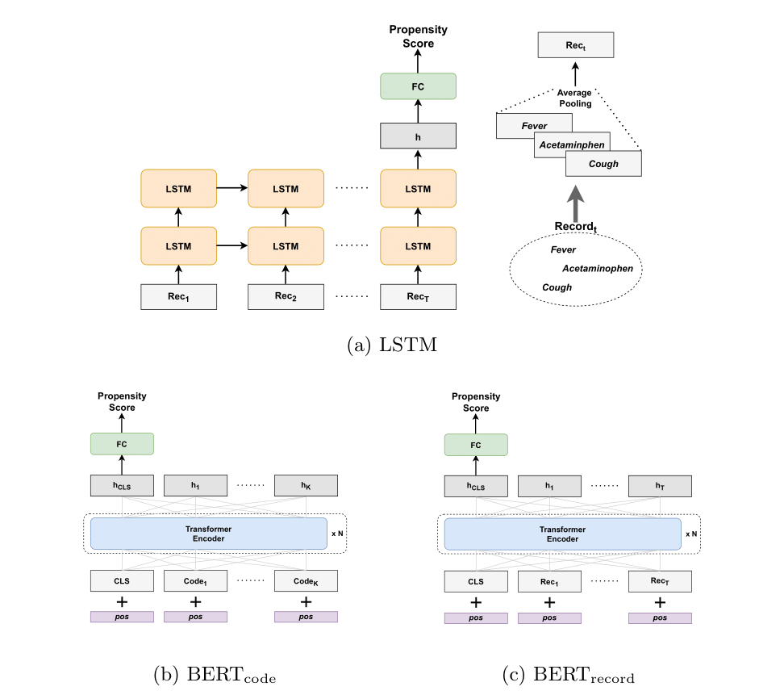

## Accurate Treatment Effect Estimation using Inverse Probability of Treatment Weighting with Deep Learning

This repository contains codes for implementing models and reproducing the experiments in our paper ["Accurate Treatment Effect Estimation using Inverse Probability of Treatment Weighting with Deep Learning"](https://arxiv.org/abs/2406.08851).


As illustrated in the figure, we used deep sequence models (LSTM and Transformer) to estimate the propensity score using the patient's electronic health records, which is used for treatment effect estimation via inverse probability of treatment weighting.


### Installation

The code is written in **Python 3.9.13**. To install the required dependencies, run:

```
pip install -r requirements.txt
```


### Experiments

We provide Jupyter notebooks for reproducing the experiments.


### Citation

>@article{lee2024inverse,
>  author    = {Lee, Junghwan and Ma, Simin and Serban, Nicoleta and Yang, Shihao},
>  title     = {Inverse Probability of Treatment Weighting with Deep Sequence Models Enables Accurate treatment effect Estimation from Electronic Health Records},
>  journal   = {arXiv preprint arXiv:2406.08851},
>  year      = {2024}
>}

| Field   | Value |
|---------|------------------------------------------------------------|
| **Author**  | Lee, Junghwan; Ma, Simin; Serban, Nicoleta; Yang, Shihao |
| **Title**   | Inverse Probability of Treatment Weighting with Deep Sequence Models Enables Accurate Treatment Effect Estimation from Electronic Health Records |
| **Journal** | arXiv preprint arXiv:2406.08851 |
| **Year**    | 2024 |